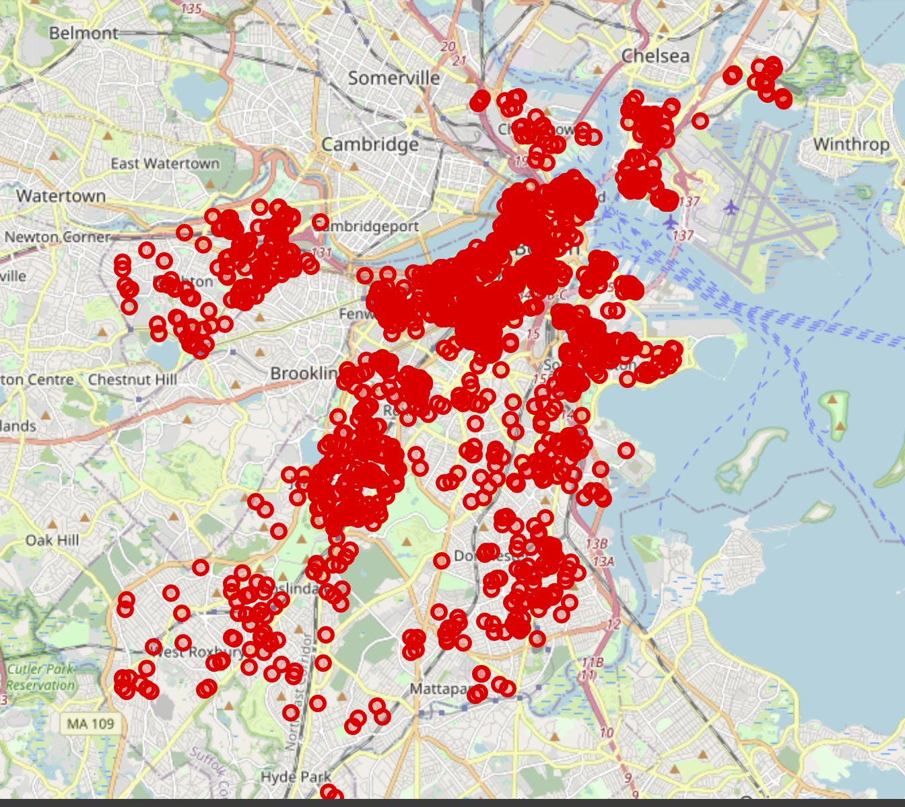
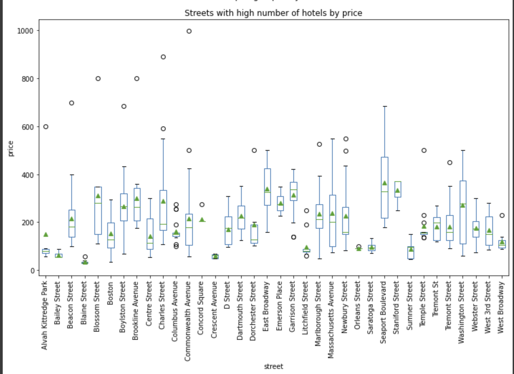
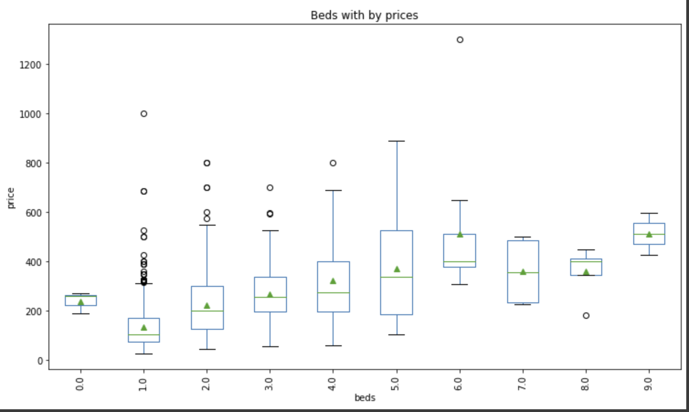
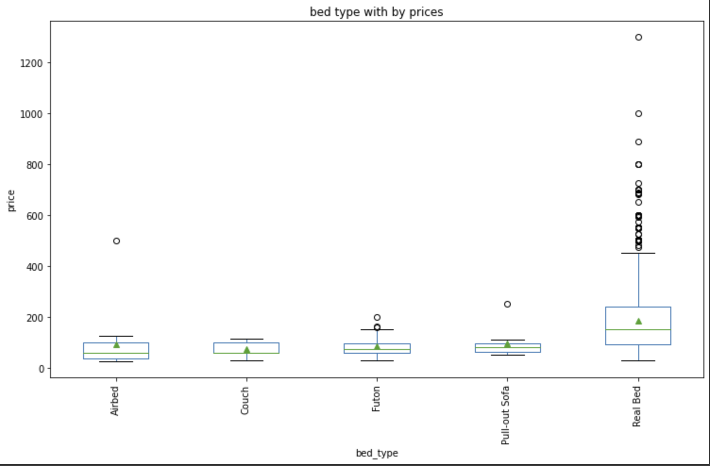
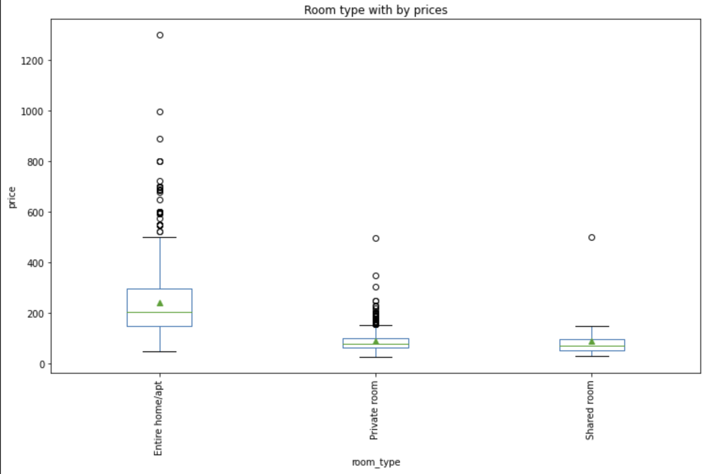
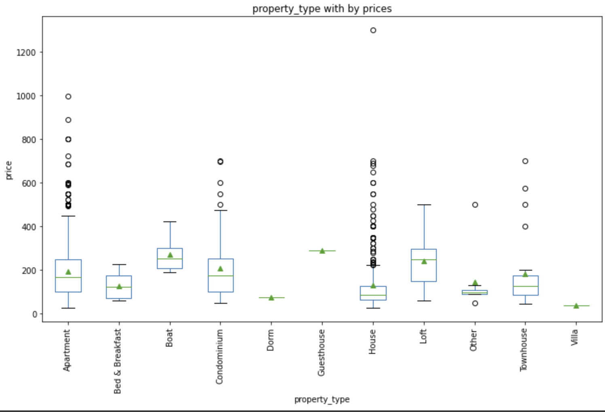
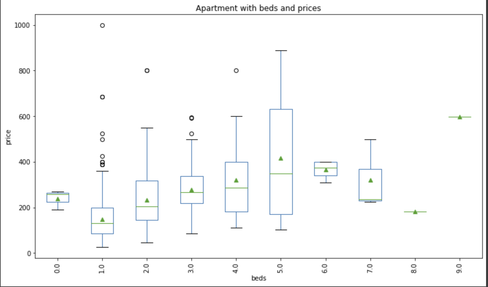
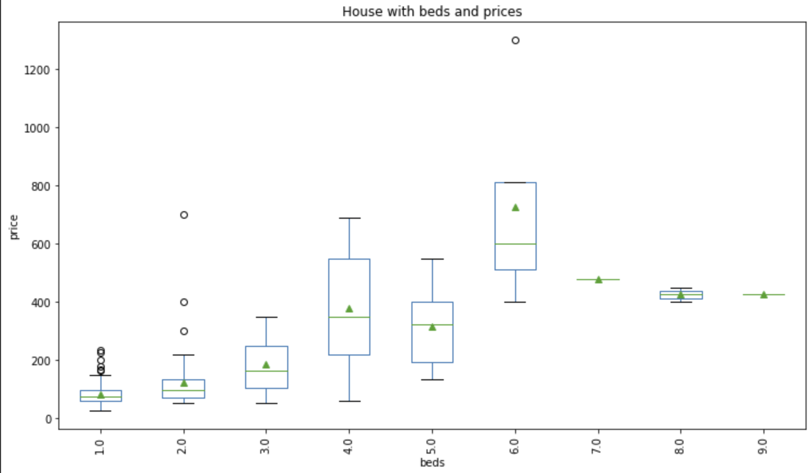
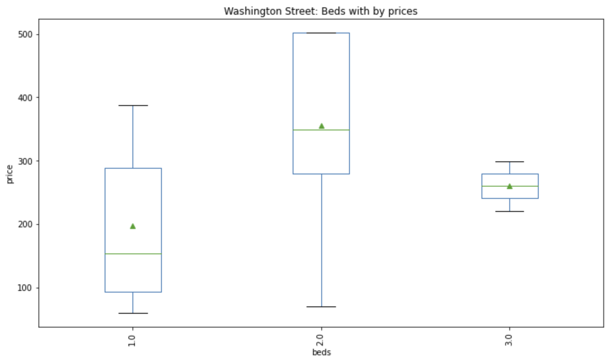
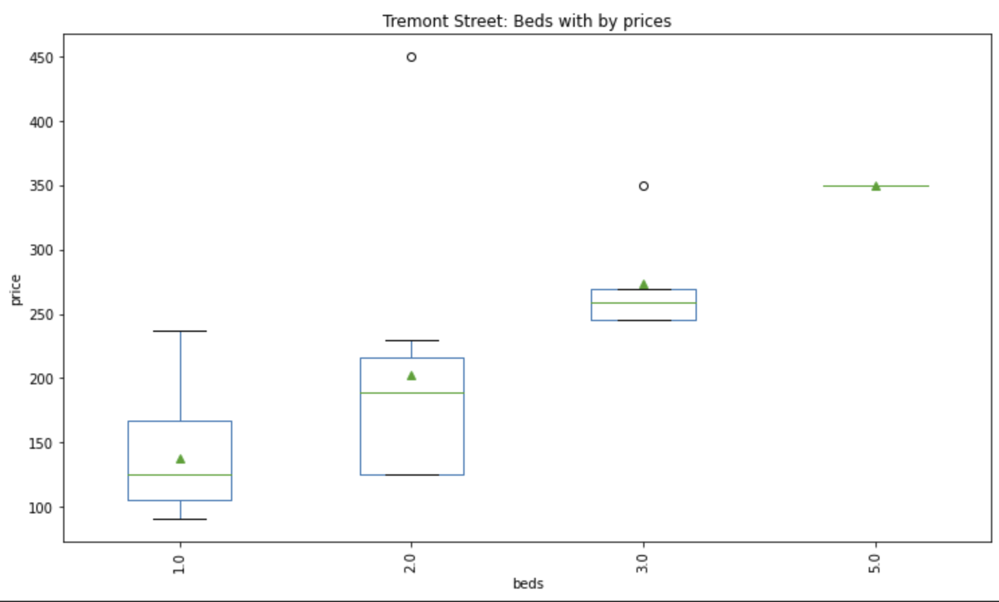

# Boston Airbnb Data Analysis

My blog: https://medium.com/@leuleu742/boston-airbnb-data-analysis-8f874185e9b9

## I.Overview
It is considered as a very important factor when travelling is finding a good place to stay. In this project, I use the Boston Airbnb Data to analyse the places and prices by streets and their own facilities.
## II.Data Description
The data in the archive contains 3 raw datasets. In this project, I use 2 datasets: listings.csv, calendar,csv, pre-processing and merge them in to 1 cleaned_data.
- Raw data:
    + calendar.csv
    + listings.csv
    + reviews.csv
- Cleaned data:
    + cleaned_data.csv: merging from calendar.csv and listings.csv

## III.Workflow Description
### Libraries used
- Pandas (no restricted version)
- Matplotlib.pyplot (no restricted version)
- folium (no restricted version)
### Cleaning data:
    + Handle categorical and missing data
    + Remove uninterested columns
    + Denormalizing street column
    + Changing data type: timestamp, int 
### Analysis:
    + Adding assumptions and processing data to analyse the question and find the answers.
## IV.There big questions
1. Pretend: Let's say a group of visitors travels in 1st,Dec,2016 and plans to stay in Boston,US. What room is available to them during that days?
2. What are the prices between streets in Boston?
3. Presumably,Could the room type and other facilities contribute to the differences in price?

## V.Detail Analyses
1. **Available room in 2022, Dec, 1** \
Firstly, I filtered the data by date and plot them in World Map. As we can see, there are many available places in different streets. Try out to adjust the Map in file notebook.

2. **Differences in price by street** \
Next, I group by street, caculate the mean prices and count the number of places in each street. Looking at the num of places in each street, we can see that some streets have lots of hotels. Do those streets have hotels are nearly the same prices or there are still the differences in prices? I filter out the number of places over 6 (crowded street) and use box plot to look at the distribution of price in each crowded street

 

The average prices in streets having the number of hotels higher than 6 are ranging from $100-$300. However, there are some outlier prices which can cause effects in the average prices. Some are more than $600. Therefore, the prices are not only different by street but also the difference in 1 street. Presumably, the room type and other facilities could make the differences. Let's analyse is the assumption right or not? ( In part 3) \
In addition, there are some streets have Mean higher than Median that means those streets' price distributions are left-skewed, in other word, most of places in those streets have low prices than the average price. 

3. **Differences in price by facilites** \
When trying to boxplot category features. We can see the prices are different by the facilities each place provides.

We can see the prices are different by the number of beds, room type. However, there are many outliers in beds = 1, bed_type = Real_bed, room_type, property_type = Apartment or House. This is because each of type relating to other like when filtering department and using boxplot in beds and price, we can see the same price order by number of beds showed below.

Looking at the streets which have high number of places. We can see the prices are still different by the facilities they provide.

## VI.Conclusion
All in all,the prices between places to stay avalable for a specific day (2016, Dec, 1) are different in not only street ( some crowded street have quite high prices, but also by the facilities those places have. Such as the number of beds, or rome_type like Apartment/ House and other facilities visulized in the boxplots above. The first hand analysis and the result can be used to support to filter data for a recommendation system in tourism. For deep dive analysis, we can add some mock_visitor-requirement to have more insight results.

## Licensing, Authors and Acknowledgements 
- <a href="https://www.kaggle.com/datasets/airbnb/boston" target="_blank">Data</a>.
- Acknowledgements: This dataset is part of Airbnb Inside, and the original source can be found <a href="http://insideairbnb.com/get-the-data/" target="_blank">here</a>.
